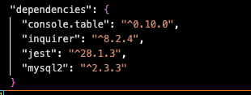

# 12_Employee-Super-Tracker
### 

UT Austin Full-Stack Flex Bootcamp Assignment 12

## Table of Contents:

- [Description](#description)
- [Installation](#installation)
- [Usage](#usage)
- [Contributors](#contributing)
- [Questions](#questions)

## Description
This application is a command-line based program to interact, view, and alter the contents of a Database. The contents include different departments, roles, and employees and their respective attributes. 

  

## Installation
this application requires the use of a few modules and software:
npm node, 
npm inquirer, 
mySQL, 
npm console.table
I also used mySQLWorkbench but it is not required for the functionality of this application.
 
  

## Usage

This app is free to use 

To begin with my starter database, login into mysql and run source schema.sql and source seeds.sql to have starter tables and sample data.

  

Next run node index.js or an equivalent to enter prompts which allow you to navigate and edit the database.

  

## Contributing

AskBCS helped

## Questions?

If there are any questions please reach out to: lev@merka.us